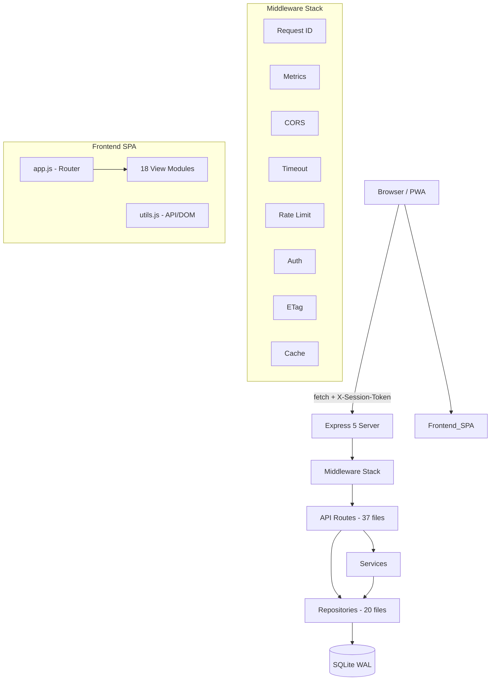
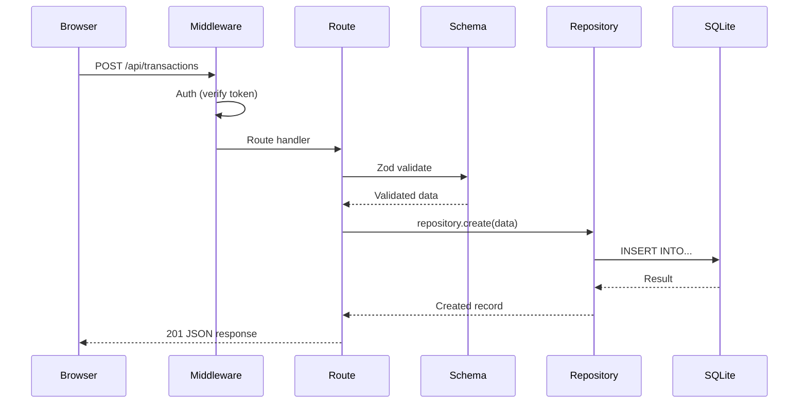

# FinanceFlow Architecture

## System Overview

## Data Flow

## Key Design Decisions

| Decision | Choice | Rationale |
|----------|--------|-----------|
| Database | SQLite (WAL) | Zero-config, single-file, fast reads |
| Auth | Session tokens in header | Inherently prevents CSRF |
| Frontend | Vanilla JS SPA | No build step, fast development |
| Testing | node:test + supertest | Zero dependencies, native Node.js |
| Icons | Material Icons (self-hosted) | Privacy, no CDN dependency |
